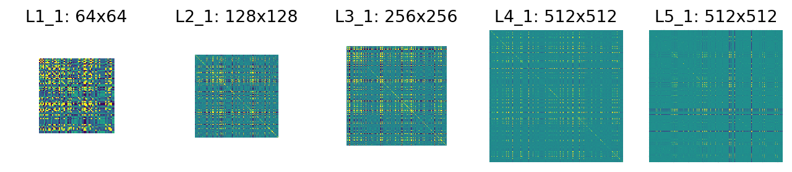

Image Encoders
==============

When generating images, pixel colors aren't the most useful way to describe an image!  You need ways to capture the patterns of an image so they can be modified to generate new images. 🖼️

In deep learning, this is done with an ``Encoder``: a neural network that takes an input image and outputs statistics about the higher-level features found.  It's useful for a variety of downstream applications for high-quality image synthesis. 📊

This repository contains a collection of deep encoders implemented in *PyTorch* that computes features of the image at different scales.  You can integrate these into your own *Python* applications! ⚙️

Pretrained Models
-----------------

The pretrained models are automatically downloaded and available under the Creative Commons `BY-NC-SA License <https://creativecommons.org/licenses/by-nc-sa/3.0/>`_.  They have the following properties:

* Normalized activations with mean ``1.0``, based on the statistics of 50k samples from ImageNet's validation set. 

* Only convolution layers are included at 16-bit data format for more compact downloads than a full classifier.

These are the models currently available:

============       ===========      ========
Model              Version          Size
============       ===========      ========
VGG11              bbd30ac9         17Mb
VGG13              c768596a         18Mb
VGG16              397923af         28Mb
VGG19              dcbb9e9d         38Mb
------------       -----------      --------
Thinet-Small       scratch-B        15Mb
Thinet-Tiny        scratch-B        2Mb
============       ===========      ========

The VGG family of networks are based on versions from the `official torchvision library <https://github.com/pytorch/vision>`_, and the Thinet family is based on the `Rethinking Network Pruning <https://github.com/Eric-mingjie/rethinking-network-pruning/tree/master/imagenet/thinet>`_ repository.
